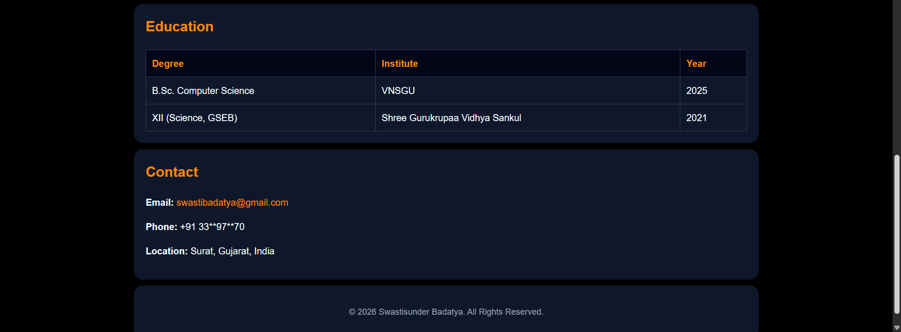

# HTML Resume Page Assignment

## Web Dev Cohort 2026

This is a **single-page resume website** built using **pure HTML and inline CSS** as part of the _HTML Resume Page Assignment_.

The objective of this assignment is to show:

- Proper HTML structure
- Semantic HTML usage
- Clean layout and readable UI

---

## Project Structure

```

.
├── Resume-Assignment.html
├── README.md
└── screenshot/
    ├── screenshot-01.png
    ├── screenshot-02.png
    ├── screenshot-03.png
    └── screenshot-04.png

```

---

## Screenshots

### Resume Preview




---
